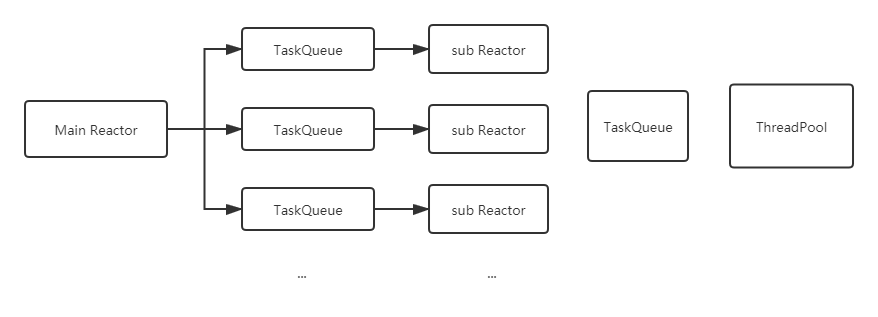

# SimpleServer
一个简单的httpServer，学习用

### Build
```
make
make clean
```

### Run
```
./httpserver [port] [subReactorNum] [workerThreadNum]
```

线程模型：
主IO线程负责Accept,之后将tcp连接挂到多个从Reactor中的一个（Round-Robin）负责读写fd,计算任务由计算线程池负责



### 模型的思考：
- 1.来一个链接创建一个线程处理（频繁创建销毁）
- 2.主线程accept，线程池处理（可能有的线程会轮空）
- 3.Reactor的模式用于分发